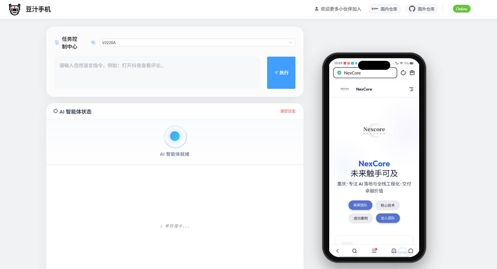
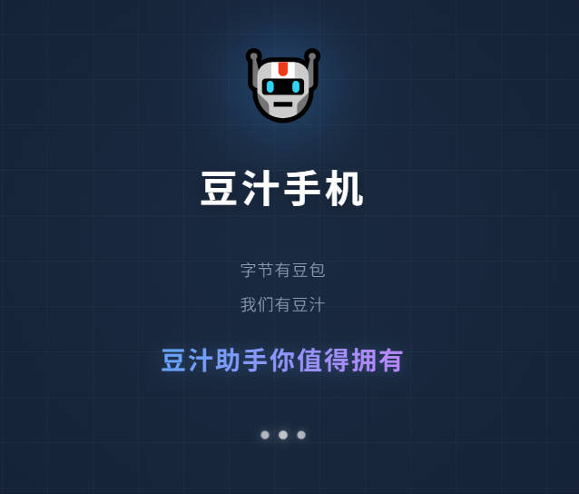
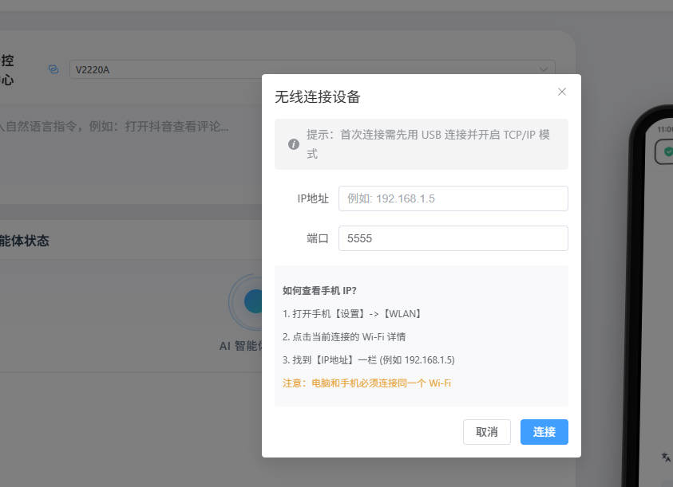

<div align="center">
  

  <h1>🤖 豆汁手机 (DouZhi Phone)</h1>
  
  <p>
    <strong>字节有豆包 · 我们有豆汁</strong><br>
    <span style="font-size: 1.2em; color: #409EFF;">✨ 豆汁助手，你值得拥有 ✨</span>
  </p>

  <p align="center">
    <a href="https://gitee.com/Lapper/douzhi-phone" target="_blank">
      
    </a>
    &nbsp;&nbsp;&nbsp;
    <a href="https://github.com/Lappercn/DouZhiPhone" target="_blank">
      
    </a>
    &nbsp;&nbsp;&nbsp;
    <a href="https://www.tongzhilian.cn" target="_blank">
      
    </a>
  </p>

  <p>
    <a href="#-项目简介">项目简介</a> •
    <a href="#-核心特性">核心特性</a> •
    <a href="#-新手教程">新手教程</a> •
    <a href="#-技术架构">技术架构</a> •
    <a href="#-加入我们">加入我们</a>
  </p>
</div>

---

## 📖 项目简介

**豆汁手机 (DouZhi Phone)** 是一款基于 **多模态大模型 (LLM)** 与 **计算机视觉 (CV)** 驱动的 Android 智能助手。

与依赖死板脚本或 XML 控件树的传统自动化工具不同，豆汁手机像人类一样通过“视觉”理解屏幕内容，并智能规划操作路径。无论你是自动化测试工程师，还是 AI Agent 探索者，豆汁手机都能为你提供强大的支持。

> **DouZhi Phone** is an advanced Android automation agent powered by Large Language Models (LLMs) and Computer Vision. Unlike traditional automation tools, it "sees" the screen and "thinks" about how to operate apps, just like a human.

> ⚠️ **Attention**: 根据 [LICENSE](./LICENSE) 协议，使用本软件前请务必在 Gitee 或 GitHub 仓库点亮 **Star** ⭐️。您的支持是我们持续维护的动力！
>
> **According to the LICENSE, please Star ⭐️ the repository before using this software.**

## ✨ 核心特性

- **🗣️ 自然语言控制**：直接告诉它“给妈妈发微信说晚上不回家吃饭”，剩下的交给它。
- **👁️ 纯视觉驱动**：基于截图和归一化坐标 (0-1000) 进行交互，完美兼容那些屏蔽了无障碍服务 (Accessibility) 的 App。
- **🧠 智能推理环**：内置“观察-思考-行动”循环，具备自我纠错能力。如果操作失败，它会重试或换一种方式。
- **⚡ 高性能**：优化的 ADB 通信，智能输入处理（自动切换键盘、文本清除）。
- **🛡️ 安全可控**：内置死循环检测和重复操作预警，防止自动化失控。

## 📸 界面展示 (Gallery)

<div align="center">
  
  <p><strong>💻 沉浸式实时控制台 (Immersive Console)</strong><br><em>实时监控，全局掌控</em></p>
  <br>
</div>

<div align="center">
  <table align="center">
    <tr>
      <td align="center">
        
        <br>
        <strong>🚀 极速启动 (Loading)</strong>
      </td>
      <td align="center">
        
        <br>
        <strong>📡 无线远程控制 (WiFi Control)</strong>
      </td>
    </tr>
  </table>
</div>

## �� 新手教程

### 1. 准备工作 (Prerequisites)
在开始之前，请确保你的电脑上安装了以下环境：
1.  **Node.js**：版本需 18 或更高。
2.  **ADB 工具**：确保 `adb` 命令在你的系统 PATH 中（通常随 Android Studio 或 SDK Platform-Tools 安装）。
3.  **Android 设备**：真机或模拟器均可，必须开启 **USB 调试**。
4.  **豆包 API Key**：你需要从 [火山引擎 (Volcengine)](https://www.volcengine.com/) 获取 API Key。

### 2. 安装步骤 (Installation)

**第一步：克隆仓库**
推荐国内用户使用 Gitee，速度更快：
```bash
# Gitee (推荐)
git clone https://gitee.com/Lapper/douzhi-phone.git

# GitHub
git clone https://github.com/Lappercn/DouZhiPhone.git

cd douzhi-phone
```

**第二步：安装后端依赖**
```bash
npm install
```

**第三步：配置 API Key**
修改 `config/default.json` 文件（或者新建 `config/local.json` 覆盖配置），填入你的 Key：
```json
{
  "doubao": {
    "apiKey": "YOUR_API_KEY_HERE",
    "model": "doubao-pro-32k"
  }
}
```

### 3. 启动运行 (Running)

**启动后端服务**
在项目根目录下运行：
```bash
npm run server
```

**启动前端界面**
打开一个新的终端窗口，进入 `frontend` 目录：
```bash
cd frontend
npm install
npm run dev
```

**开始控制**
1.  用 USB 线连接你的 Android 手机。
2.  浏览器打开 `http://localhost:5173`。
3.  你应该能看到手机屏幕镜像。在输入框输入指令（例如：“打开设置查看WiFi”），开始体验！

## 🏗️ 技术架构

豆汁手机采用现代化的前后端分离架构：

*   **前端 (Frontend)**: Vue 3 + Element Plus (响应式 UI，实时屏幕镜像)
*   **后端 (Backend)**: Node.js + Express (API 服务，ADB 设备管理)
*   **Agent 核心**: 
    *   **Planner (规划器)**: 基于 LLM 的推理核心 (观察 -> 思考 -> 行动)。
    *   **Executor (执行器)**: 健壮的指令执行层 (ADB/Monkey/Shell)。
    *   **Verifier (验证器)**: 视觉闭环验证机制。

## 🤝 加入我们

**我们是一个充满激情的技术团队，致力于探索 AI 与移动端的无限可能。**

### 🌟 为什么要加入？

*   **前沿技术**：接触最新的 LLM (豆包, GPT-4o) 和计算机视觉技术。
*   **实际落地**：打造一款真正能改变移动测试和自动化现状的工具。
*   **极客社区**：结识一群志同道合的开发者。

### 🚀 如何贡献？

- **提交 PR**: 修复 Bug，增加新功能（比如支持更多 App，优化推理逻辑）。
- **反馈 Issue**: 发现问题？请在 [Gitee Issues](https://gitee.com/Lapper/douzhi-phone/issues) 或 [GitHub Issues](https://github.com/Lappercn/DouZhiPhone/issues) 告诉我们。
- **扩散项目**: Star 一下仓库，并分享给你的朋友！

**国内开发者**：推荐使用 [Gitee 仓库](https://gitee.com/Lapper/douzhi-phone) 提交 Issue 和 PR。
**Global Developers**: Please use [GitHub Repository](https://github.com/Lappercn/DouZhiPhone).

### ☕ 联系我们

- **官方网站**: [www.tongzhilian.cn](https://www.tongzhilian.cn)
- **Email**: contact@tongzhilian.cn

让我们一起把“豆汁”熬得更浓、更香！🔥

---

<div align="center">
  <p>© 2025 DouZhi Phone Team | Powered by <a href="https://www.tongzhilian.cn">同智联</a></p>
</div>
